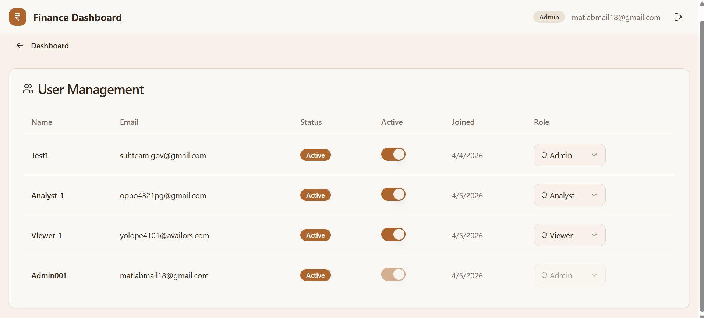
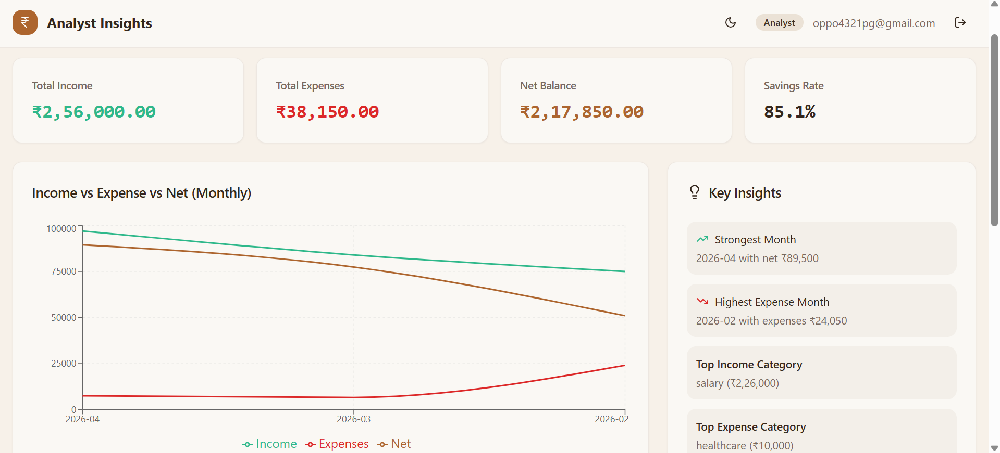
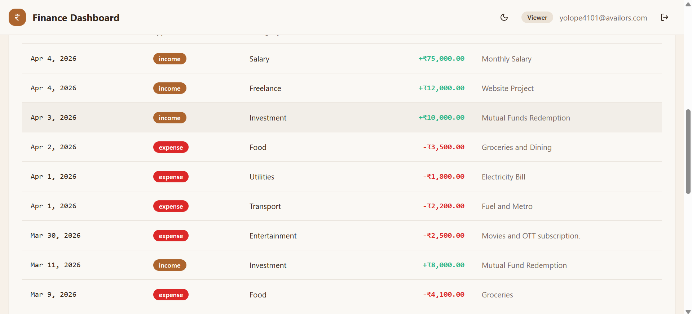
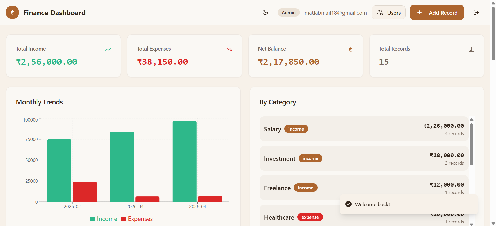

# Finance Data Processing and Access Control Backend
## Sample Login Credentials

**Analyst**

- Username: `Analyst_1`
- Password: `edHa#r24$g`

**Viewer**

- Username: `Viewer_1`
- Password: `yolOPe4101@`

**Admin**

- Username: `Admin001`
- Password: `Hus%dhd65`

This project is a backend-focused finance management system built with:

- React + Vite frontend
- Supabase (PostgreSQL + Auth)
- Role-based access control using Row Level Security (RLS)
- Database functions, triggers, and write rate limiting

The implementation follows the requirements for secure role handling, record management, summary APIs, validation, and persistence.

### 1) Role and Access Management

Implemented roles:

- `viewer`
- `analyst`
- `admin`

Access behavior is enforced at database level using RLS policies and helper functions (`has_role`, `get_user_role`).


Figure 1: Admin role view with full access controls.


Figure 2: Analyst role view with create and update permissions.


Figure 3: Viewer role view with read-only access.

### 2) Financial Records Management

Core operations implemented:

- Create records
- Read records with filtering and pagination
- Update records
- Soft delete records (`deleted_at`)

Fields:

- amount, type (`income`/`expense`), category, date, notes

### 3) Dashboard Summary APIs (RPC)

Implemented database functions:

- `get_dashboard_summary()`
- `get_category_summary()`
- `get_monthly_trends()`
- `get_recent_activity(limit_count)`

All summary functions validate user role before returning data.


Figure 4: Dashboard overview with summary cards, charts, and records.

### 4) Validation and Error Handling

- Password strength checks on signup
- Input validation in forms
- Database constraints and policy-based authorization
- Graceful UI errors via toast notifications

### 5) Data Persistence

- All financial data and user metadata persist in Supabase PostgreSQL
- Role assignments persist in `user_roles`
- Profiles auto-created for new users by trigger

### 6) Security Features

- RLS enabled on all main tables
- Role-specific policies for read/write control
- Rate limiting for financial record writes (per user)

## Database Scripts

SQL files are stored in:

- `Database-Code/base-schema.sql`
- `Database-Code/rate_limit.sql`

Recommended order in Supabase SQL Editor:

1. `base-schema.sql`
2. `rate_limit.sql`

## Tech Stack

- React 18
- TypeScript
- Vite
- Supabase JS Client
- React Query
- Tailwind CSS + shadcn/ui
- Recharts

## Environment Variables

Create `.env` in project root:

```env
VITE_SUPABASE_PROJECT_ID="your-project-id"
VITE_SUPABASE_PUBLISHABLE_KEY="your-publishable-key"
VITE_SUPABASE_URL="https://your-project-id.supabase.co"
```
Use `.env.example` as the template. Never commit real secrets.

## Run Locally

```bash
npm install
npm run dev
```

App runs at `http://localhost:8080` (or the Vite port shown in terminal).

## Build and Test

```bash
npm run build
npm run test
```

Optional:

```bash
npm run lint
```

## End-to-End Tests (Playwright)

This project includes two starter Playwright tests in `tests/`:

- `auth.spec.ts`: verifies auth page rendering and login/signup mode toggle.
- `protected-route.spec.ts`: verifies unauthenticated users are redirected to `/auth`.

Install Playwright browsers once:

```bash
npx playwright install
```

Run E2E tests:

```bash
npm run test:e2e
```

Run E2E tests in headed mode:

```bash
npm run test:e2e:headed
```

## Deployment

Deploy the frontend to your preferred host and connect Supabase as backend.

## Project Structure

```text
Finance-System/
	Database-Code/
		base-schema.sql
		rate_limit.sql
	src/
		components/
		hooks/
		integrations/supabase/
		pages/
	.env.example
	README.md
```
- Authorization is enforced in the database (RLS), not only in frontend logic.
- Financial records support soft deletion for audit-friendly behavior.
- Summary endpoints are implemented as secure database RPC functions.
- Write rate limiting is implemented via trigger + function in PostgreSQL.

# Minimal Supabase Backend Wrapper

This is a thin Node.js + Express layer that proxies authenticated requests to Supabase.

## Why this exists

- Gives the project a conventional backend shape for evaluation
- Keeps Supabase as the data source
- Exposes a single dashboard wrapper endpoint for cleaner demos

## Endpoints

- `GET /api/health`
- `GET /api/auth/me`
- `POST /api/auth/resolve-login`
- `GET /api/dashboard`
- `GET /api/records`
- `POST /api/records`
- `PATCH /api/records/:id`
- `DELETE /api/records/:id`
- `GET /api/admin/users`
- `PATCH /api/admin/users/:userId/role`
- `PATCH /api/admin/users/:userId/status`

## API Documentation

- Swagger UI: `GET /api/docs`
- OpenAPI JSON: `GET /api/openapi.json`

The documentation URL will be:

`https://<your-backend-domain>/api/docs`

## Setup

1. Run:

```bash
npm install
npm run dev
```

The server starts on `http://localhost:4000`.
`
